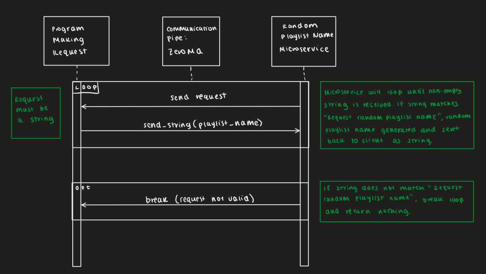

# cs-361-microservice-a

# Communication Contract for Microservice A
In addition to the microservice file, you will need to have two text files with the exact names adjectives.txt and verbs.txt; one is a list of adjectives and the other is a list of verbs. These files need to be in comma and space separated format (ex: apple, banana, pear). Additionally, these files need to have 100 terms. I have created two files: one with 100 random adjectives and one with 100 random verbs that you may use if you wish (they will be in the GitHub repo I share).   
## How To Programatically REQUEST data
Once your environment and sockets have been set up, use send_string() to send the string "Request random playlist name". This will tell the server to randomly generate a playlist name in the format "Adjective Verb". If the client sends a string that is not "Request random playlist name", the server will stop. If the client sends an empty string, the server will continue running and will not send anything back to the client.
### Example Call
``` 
  socket.send_string("Request random playlist name") 
```
## How to Programatically RECEIVE data
The message will come back as a string which you can receive using recv(). You will need to decode this string as ZeroMQ defaults to UTF-8 encoding. You can use .decode to do this.
### Example Call
```
  message = socket.recv()
  decoded_message = message.decode()
```
## UML Sequence Diagram

